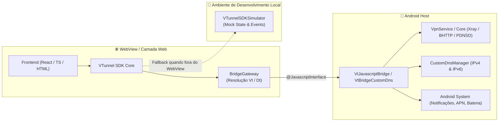

# 🛡️ VTunnel SDK

<div align="center">

[](https://github.com/TelksBr/VTunnelSDK)
[](https://www.typescriptlang.org/)
[](https://react.dev/)
[](LICENSE)
[](tests/)

**SDK moderno em JavaScript / TypeScript para integração contínua entre páginas Web e o WebView nativo do VTunnel Android.**

[Guia Rápido](#-guia-rápido) •
[Módulos da API](#-módulos-da-api) •
[Custom DNS](#-módulo-custom-dns-sdkdns) •
[Simulador Web](#-simulador-sem-android) •
[React Hooks](#-suporte-a-react) •
[Documentação Completa](./docs/README.md)

</div>

---

## 🌟 Destaques

- **Arquitetura Modular**: Módulos especializados `main`, `config`, `dns`, `android`, `app` e `text`.
- **🌐 Novo Módulo Custom DNS (`sdk.dns`)**: Gerenciamento de servidores DNS IPv4/IPv6 do cliente, presets populares (Cloudflare, Google, Quad9, etc.) e chamada nativa do modal de diálogo.
- **🔄 Compatibilidade Bidirecional Total**: Fallback automático entre as interfaces `Vt...` (nova) e `Dt...` (legada). O mesmo código funciona em versões antigas e novas do aplicativo host Android.
- **🧪 Simulador Web Completo**: Desenvolva e teste sua interface em qualquer navegador desktop (Chrome, Edge, Firefox) sem precisar compilar o APK Android.
- **⚛️ Suporte Nativo a React**: Componentes e hooks prontos (`VTunnelSDKProvider`, `useVTunnelSDK`, `useVTunnelEvent`, `useVTunnelError`).
- **⚡ CLI de Criação Rápida**: Inicialize projetos prontos com templates pré-configurados em 1 comando (`npx vtunnel-sdk init`).
- **📦 Build em Arquivo Único**: Gera um arquivo HTML único (`dist/build.html`) pronto para ser servido no WebView nativo do aplicativo.

---

## 🏗️ Arquitetura da Bridge



---

## 🚀 Instalação

```bash
npm install vtunnel-sdk
```

> **Compatibilidade Retroativa:** Se seu projeto legado importa `dtunnel-sdk`, você pode continuar importando ou alternar gradualmente para `vtunnel-sdk` sem quebras de código.

---

## ⚡ Criador de Projetos (CLI)

Gere uma aplicação completa pré-configurada com Vite, TypeScript ou CDN:

```bash
npx vtunnel-sdk init meu-app
```

Ou especificando o template diretamente:

```bash
# Template React 18 + Vite + TypeScript (Recomendado)
npx vtunnel-sdk init meu-app --template react-typescript

# Template TypeScript Puro + Vite
npx vtunnel-sdk init meu-app --template typescript

# Template CDN em arquivo HTML único
npx vtunnel-sdk init meu-app --template cdn
```

### Compilar para o Android (Arquivo Único)

Dentro da pasta do projeto gerado, execute:

```bash
npm run build:android
```

O arquivo pronto para produção será gerado em:
`dist/build.html` (todas as dependências, JS e CSS inlined).

---

## 📖 Guia Rápido

### TypeScript / ES Modules

```ts
import VTunnelSDK from 'vtunnel-sdk';

const sdk = new VTunnelSDK({
  strict: false,                 // Se false, retorna null em ausência de bridge e dispara evento
  autoRegisterNativeEvents: true, // Registra callbacks nativos automaticamente
});

// Ouvir atualizações de status da VPN
sdk.on('vpnState', (event) => {
  console.log('Estado atual da VPN:', event.payload);
  // 'CONNECTED' | 'DISCONNECTED' | 'CONNECTING' | 'STOPPING' | 'NO_NETWORK' | 'AUTH'
});

// Conectar a VPN
sdk.main.startVpn();

// Desconectar a VPN
sdk.main.stopVpn();
```

---

## 🧩 Módulos da API

| Módulo | Acesso | Descrição Principal |
| :--- | :--- | :--- |
| **VPN & Conexão** | `sdk.main` | Iniciar/parar VPN, status da conexão, anúncios, logs e diagnóstico |
| **Configurações** | `sdk.config` | Categorias, servidores, seleção de config, importação offline |
| **Custom DNS** | `sdk.dns` | Gerenciamento de servidores DNS do cliente (IPv4/IPv6) e presets |
| **Android & Sistema** | `sdk.android` | Insets de barra de status/navegação, notificações, hotspot, clipboard |
| **App & Telas** | `sdk.app` | Configurações do app, abertura de telas de configurações do sistema |
| **Texto & Tradução** | `sdk.text` | Tradução de labels nativas com base no idioma do aplicativo |

---

## 🌐 Módulo Custom DNS (`sdk.dns`)

O módulo `sdk.dns` permite que a interface Web consulte e altere os servidores DNS personalizados do cliente, dando prioridade a esses servidores sobre as configurações padrão da VPN.

```ts
// 1. Verificar se o DNS customizado do usuário está ativo
const isEnabled = sdk.dns.isEnabled();

// 2. Consultar o DNS atualmente configurado
const dnsConfig = sdk.dns.get();
console.log(dnsConfig);
/*
{
  enabled: true,
  primary: "1.1.1.1",
  secondary: "1.0.0.1",
  servers: ["1.1.1.1", "1.0.0.1"]
}
*/

// 3. Obter lista de presets disponíveis
const presets = sdk.dns.getPresets();
console.log(presets);
/*
[
  { id: "cloudflare", name: "Cloudflare", primary: "1.1.1.1", secondary: "1.0.0.1" },
  { id: "google", name: "Google DNS", primary: "8.8.8.8", secondary: "8.8.4.4" },
  { id: "quad9", name: "Quad9", primary: "9.9.9.9", secondary: "149.112.112.112" },
  { id: "adguard", name: "AdGuard DNS", primary: "94.140.14.14", secondary: "94.140.15.15" },
  { id: "opendns", name: "OpenDNS", primary: "208.67.222.222", secondary: "208.67.220.220" }
]
*/

// 4. Salvar novo DNS customizado (via Objeto)
sdk.dns.set({
  enabled: true,
  primary: "8.8.8.8",
  secondary: "8.8.4.4"
});

// 5. Salvar novo DNS customizado (via Argumentos Posicionais)
sdk.dns.set(true, "9.9.9.9", "149.112.112.112");

// 6. Abrir o modal nativo do Android para edição de DNS
sdk.dns.showDialog();
```

---

## ⚛️ Suporte a React

O pacote inclui hooks e context provider otimizados para React 18+:

```tsx
import React from 'react';
import {
  VTunnelSDKProvider,
  useVTunnelSDK,
  useVTunnelEvent,
  useVTunnelError
} from 'vtunnel-sdk/react';

function VpnControl() {
  const sdk = useVTunnelSDK();
  const [vpnState, setVpnState] = React.useState(sdk.main.getVpnState());

  useVTunnelEvent('vpnState', (event) => {
    setVpnState(event.payload);
  });

  useVTunnelError((event) => {
    console.error('Erro no túnel:', event.error);
  });

  return (
    <div className="vpn-panel">
      <p>Status: <strong>{vpnState}</strong></p>
      <button onClick={() => sdk.main.startVpn()}>Conectar</button>
      <button onClick={() => sdk.main.stopVpn()}>Desconectar</button>
      <button onClick={() => sdk.dns.showDialog()}>Configurar DNS</button>
    </div>
  );
}

export function App() {
  return (
    <VTunnelSDKProvider options={{ strict: false, autoRegisterNativeEvents: true }}>
      <VpnControl />
    </VTunnelSDKProvider>
  );
}
```

---

## 🧪 Simulador (Sem Android)

Desenvolva localmente no navegador mockando respostas e disparando eventos em tempo real:

```ts
import VTunnelSDK from 'vtunnel-sdk';
import { installVTunnelSDKSimulator } from 'vtunnel-sdk/simulator';

// Instala os mocks na window (somente se não estiver em um WebView nativo)
const simulator = installVTunnelSDKSimulator({
  autoEvents: true, // Dispara eventos semânticos automaticamente ao chamar métodos
});

const sdk = new VTunnelSDK();

sdk.on('vpnState', (event) => {
  console.log('Evento VPN recebido:', event.payload);
});

// Testar chamada
sdk.main.startVpn(); // Dispara 'vpnState' -> 'CONNECTED'

// Disparar eventos manualmente
simulator.emit('newLog', 'Conexão estabelecida com sucesso');
simulator.emit('vpnState', 'DISCONNECTED');
```

---

## 📡 Tabela de Eventos Semânticos

O SDK unifica os diversos callbacks nativos do Android em eventos limpos e tipados:

| Evento | Callback Nativo (`Vt...` / `Dt...`) | Tipo do Payload |
| :--- | :--- | :--- |
| `vpnState` | `VtVpnStateEvent` / `DtVpnStateEvent` | `VTunnelVPNState \| null` |
| `vpnStartedSuccess` | `VtVpnStartedSuccessEvent` / `DtVpnStartedSuccessEvent` | `undefined` |
| `vpnStoppedSuccess` | `VtVpnStoppedSuccessEvent` / `DtVpnStoppedSuccessEvent` | `undefined` |
| `newLog` | `VtNewLogEvent` / `DtNewLogEvent` | `undefined` |
| `newDefaultConfig` | `VtNewDefaultConfigEvent` / `DtNewDefaultConfigEvent` | `undefined` |
| `checkUserStarted` | `VtCheckUserStartedEvent` / `DtCheckUserStartedEvent` | `undefined` |
| `checkUserResult` | `VtCheckUserResultEvent` / `DtCheckUserResultEvent` | `VTunnelCheckUserResult \| null` |
| `checkUserError` | `VtCheckUserErrorEvent` / `DtCheckUserErrorEvent` | `string \| null` |
| `notification` | `VtNotificationEvent` / `DtNotificationEvent` | `VTunnelNotification \| null` |
| `localIp` | `VtLocalIpEvent` / `DtLocalIpEvent` | `string \| null` |
| `networkName` | `VtNetworkNameEvent` / `DtNetworkNameEvent` | `string \| null` |
| `pingResult` | `VtPingResultEvent` / `DtPingResultEvent` | `string \| null` |
| `hotSpotState` | `VtHotSpotStateEvent` / `DtHotSpotStateEvent` | `VTunnelHotSpotStatus \| null` |
| `airplaneState` | `VtAirplaneStateEvent` / `DtAirplaneStateEvent` (+ listeners) | `ACTIVE` \| `INACTIVE` \| `ACTIVATING` \| `DEACTIVATING` |
| `error` | Disparado internamente pelo SDK em falhas de bridge | `VTunnelBridgeError` |

---

## 🧪 Verificação e Testes

O repositório possui uma suíte rigorosa de testes de integração e análise de tipos:

```bash
# Executar todos os 18 testes unitários
npm test

# Executar checagem estrita de tipos TypeScript
npm run test:typecheck
```

---

## 📚 Documentação Adicional

- 📘 [Guia de Primeiros Passos](./docs/getting-started.md)
- 📗 [Referência Completa de Métodos da API](./docs/api-reference.md)
- 📙 [Guia de Eventos e Callbacks](./docs/events.md)
- 📕 [Chamadas Diretas da Bridge sem SDK](./docs/bridge-sem-sdk.md)

---

## 📄 Licença

Distribuído sob a licença [MIT](LICENSE).
